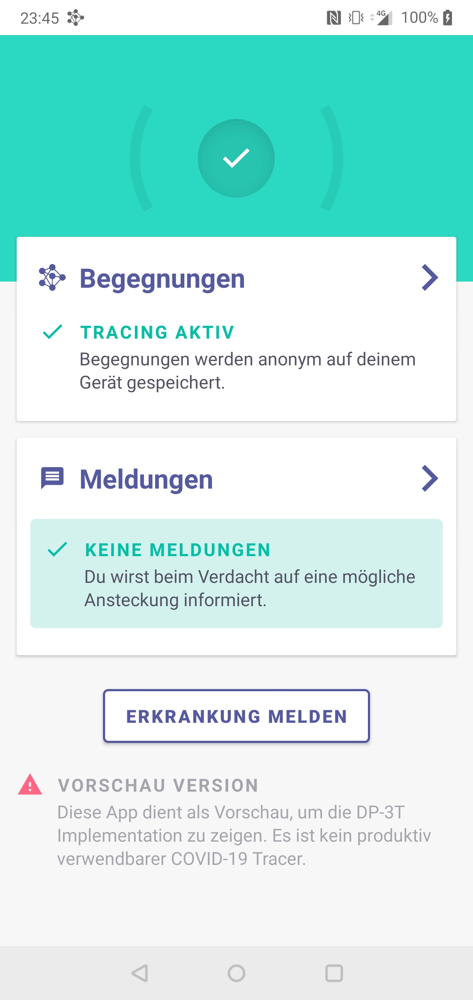
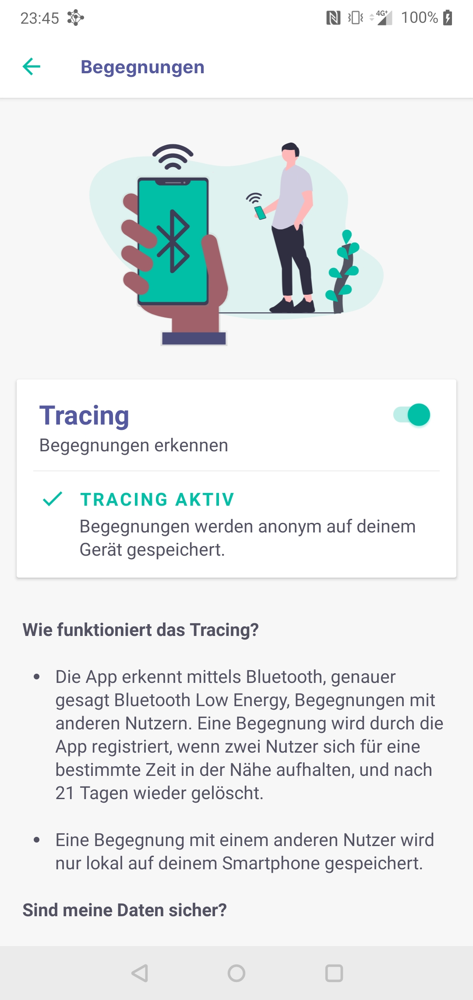
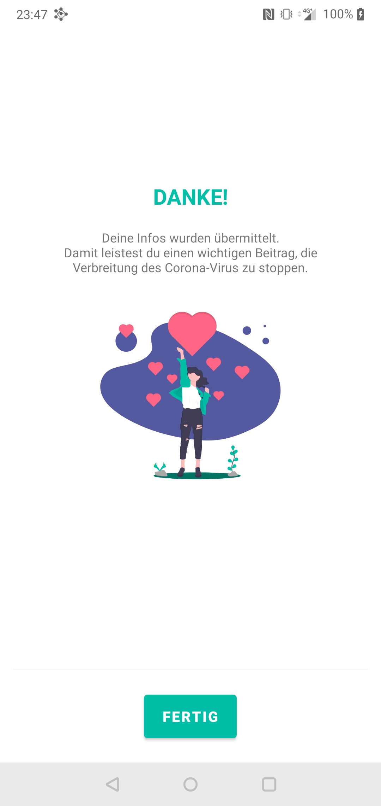

# DP3T Android Demo App

[](https://github.com/DP-3T/dp3t-app-android/blob/master/LICENSE)


## DP3T
The Decentralised Privacy-Preserving Proximity Tracing (DP-3T) project is an open protocol for COVID-19 proximity tracing using Bluetooth Low Energy functionality on mobile devices that ensures personal data and computation stays entirely on an individual's phone. It was produced by a core team of over 25 scientists and academic researchers from across Europe. It has also been scrutinized and improved by the wider community.

DP-3T is a free-standing effort started at EPFL and ETHZ that produced this protocol and that is implementing it in an open-sourced app and server.


## Introduction
This is the first implementation of a client using the [DP3T Android SDK](https://github.com/DP-3T/dp3t-sdk-android). You can install the app on [App Center](https://install.appcenter.ms/orgs/dp-3t/apps/nextstep-android/distribution_groups/internal).

<p align="center">



</p>

## Repositories
* Android SDK & Calibration app: [dp3t-sdk-android](https://github.com/DP-3T/dp3t-sdk-android)
* iOS SDK & Calibration app: [dp3t-sdk-ios](https://github.com/DP-3T/dp3t-sdk-ios)
* Android Demo App: [dp3t-app-android](https://github.com/DP-3T/dp3t-app-android)
* iOS Demo App: [dp3t-app-ios](https://github.com/DP-3T/dp3t-app-ios)
* Backend SDK: [dp3t-sdk-backend](https://github.com/DP-3T/dp3t-sdk-backend)

## Work in Progress
The demo app shows how the SDK can be used in a real app, but all content and UX aspects, especially messages and navigation flows are in an alpha stage. 

## Further Documentation
The full set of documents for DP3T is at https://github.com/DP-3T/documents. Please refer to the technical documents and whitepapers for a description of the implementation.


## Installation and Building

The project can be opened with Android Studio 3.6.1 or later or you can build the project with Gradle using
```sh
$ ./gradlew assembleProdRelease
```
The APK is generated under app/build/outputs/apk/prod/release/package-prod-release.apk

## License
This project is licensed under the terms of the MPL 2 license. See the [LICENSE](LICENSE) file.
